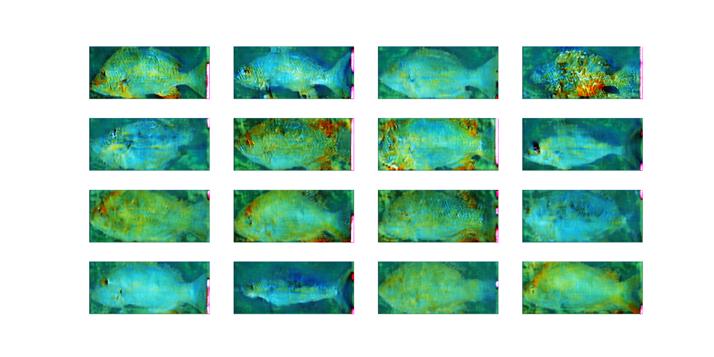

Architecture like V1

Added Feature matching by breaking up the discriminator layer.

####more.py:
Trains the gen 4 times for each time it trains the discriminator.
Used after epoch 181.
Maybe prone to Discriminator overfitting so I would want to add noise to the image. 
Also got some exploding gradients because the discriminator overfitting, with epochs with extreme changes:
######epoch 648:

######epoch 648:

#### even_more.py:
Got mode collapse after 695 epochs, with generator loss at around 4~5 and discriminator loss at around 0.2,

#####mode collapse evidence: 
######epoch 691:

so started to train the gen while the loss is greater than X, but no more than 20 at a single batch.
Initialized X to 3.
The generator loss went to around 3.5 and disc loss went to around 0.2 at epoch 698.